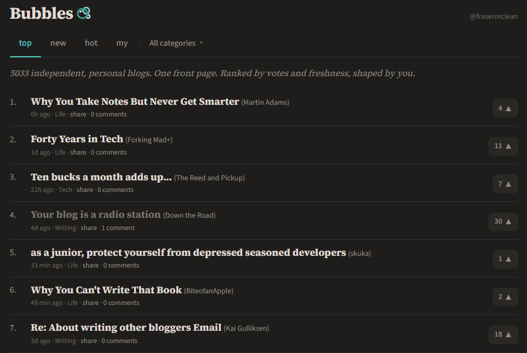
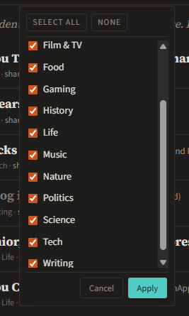

## Background

As a [Xennial](https://en.wikipedia.org/wiki/Xennials), I grew up experiencing the early days of the internet. When the web was in its infancy, it was a much more decentralized and diverse place, with countless personal blogs, forums, and small websites. It was a time when anyone could create content and share it with the world without needing to rely on large platforms. However, over the years, the internet has become increasingly dominated by a few major platforms, making it harder for independent creators to get discovered.

Lately I've been on a bit of a quest to distance myself from the big social media platforms and find more content from independent creators. I've been adding [IndieWeb](https://indieweb.org) features to my own website, and in exploring the ecosystem, I came across a new project called [Bubbles](https://bubbles.town/). 

## Introducing Bubbles

Bubbles is an interesting new project by a friendly German developer named [Ben](https://troet.cafe/@viermalbe). It aims to be a discovery engine for IndieWeb content by reading various IndieWeb RSS feeds and linking to them in a visually appealing way. Users can upvote content they like, and the most popular posts bubble up to the top of the feed. It's a simple yet effective way to discover new content from independent creators without having to rely on algorithms or big platforms.

## Features

### Filters

There are 4 main views to filter the content by:

- **Top**: This is the default view, showing the most popular posts ranked by votes, freshness, and community engagement.
- **New**: This view shows the most recently published posts, regardless of their popularity. It's a great way to discover fresh content from new creators.
- **Hot**: This view shows posts that are currently trending, based on recent votes and engagement. It's a good way to see what's currently popular in the IndieWeb community.
- **My**: This view shows posts from the site that you have added to your Bubbles account. It's a personalized feed of content from creators you follow.

### Categories

Each blog site is assigned to one of several categories, such as **Culture**, **Food**, **Tech**, etc. This allows users to filter content by their interests and discover new creators in specific niches.

### Briefing

The Bubbles author just added a new feature called [Briefing](https://bubbles.town/briefing), which is a daily edition of the top posts on Bubbles, published once a day.

## Conclusion

Overall, I think Bubbles is a fantastic new service that fills an important gap in the IndieWeb ecosystem. It provides a much-needed discovery engine for independent creators, allowing users to find fresh content without having to rely on big platforms. The voting system and categories make it easy to find content that matches your interests, and the Briefing feature is a great way to stay up-to-date with the latest posts. I really hope the project does well and continues to grow. If you're interested in discovering new IndieWeb content, I highly recommend giving Bubbles a try!