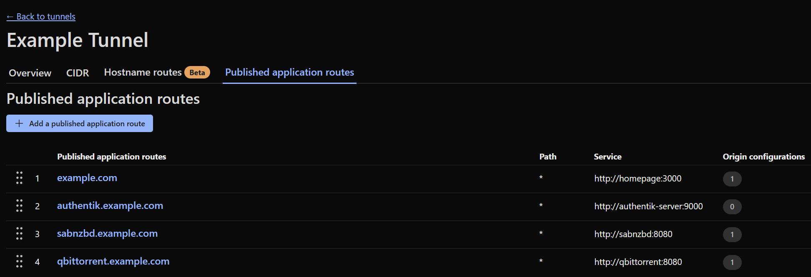

## Introduction

I've been running a homelab in various forms for several years now, hosting applications such as file servers, media servers, home automation platforms, and development environments. One of the challenges I've faced is determining the best way to access these applications, both from within my local network and remotely over the internet. 

Recently, I've been researching and experimenting with different methods to expose and access my self-hosted applications, and in this post, I want to share my findings and experiences.

## Private Access Methods

In many cases, you may want to keep your self-hosted applications private and only accessible from within your local network or through secure remote access methods. Here are some common private access methods:

### VPN (Virtual Private Network)

Used widely for secure remote access, a VPN allows you to create a secure connection to your homelab network from anywhere in the world. By connecting to the VPN, you can access your self-hosted applications as if you were on the local network. This method provides strong security and privacy, as all traffic is encrypted. You will need to configure a VPN server on your homelab and install a VPN client on your remote device. A lot of popular consumer routers have built-in VPN server capabilities, or you can use dedicated software like [OpenVPN](https://openvpn.net) or [WireGuard](https://www.wireguard.com).

### TailScale

[TailScale](https://tailscale.com) is a very popular modern VPN solution that simplifies the process of creating a secure network between your devices. It uses the WireGuard protocol to provide encrypted connections between all your devices, allowing you to access your self-hosted applications without the need for complex VPN configurations. TailScale automatically handles NAT traversal and firewall rules, making it easy to set up and use.

## Public Access Methods

You may want to expose your self-hosted applications to the public internet. For example, you may want to share files or photos with friends or family, or provide access to a web application. In these cases, you can use one of the following methods:

### Port Forwarding

Port forwarding is the original and most straightforward method of exposing applications. It requires that you have a publicly accessible IP address and that you configure your router to forward incoming traffic on specific ports to the internal IP address and port of your self-hosted application. 

While this method is simple to set up, it has several drawbacks. It exposes your applications directly to the internet, which can be a security risk if not properly configured. Additionally, managing multiple applications can become cumbersome, as each application requires its own port forwarding rule.

#### Port Forwarding Considerations

- Poking holes in your firewall (opening ports) can expose your network to automated attacks from bots scanning for vulnerabilities. Ensure that any exposed services are kept up to date and secured with strong authentication.
- Dynamic IP addresses can complicate access. If your ISP changes your public IP address, you may need to use a Dynamic DNS service to keep track of your current IP.
- Reveals your public IP address, which can be a privacy concern.
- SSL/TLS encryption must be managed manually, often requiring the use of reverse proxies and certificate management tools like [Let's Encrypt](https://letsencrypt.org).

### Cloudflare Tunnel

[Cloudflare Tunnel](https://www.cloudflare.com/products/tunnel/) (formerly known as Argo Tunnel) is a service that allows you to securely expose your self-hosted applications to the internet without opening any ports on your router. It achieves this by creating an outbound connection from your homelab to Cloudflare's network, which then routes incoming traffic to your application.

As pictured in the example above, you need to define published application routes that map to your internal services.

Cloudflare Tunnel provides several benefits, including built-in DDoS protection, SSL encryption, and easy management through the Cloudflare dashboard. It also allows you to use custom domains and take advantage of Cloudflare's performance optimizations.

### Pangolin

[Pangolin](https://pangolin.net) is an open-source alternative to Cloudflare Tunnel that allows you to expose your self-hosted applications securely without opening ports on your router. Similar to Cloudflare Tunnel, Pangolin creates an outbound connection from your homelab to a public relay server, which then routes incoming traffic to your application.