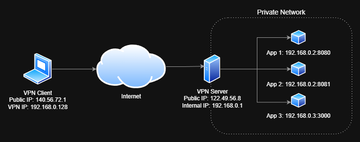
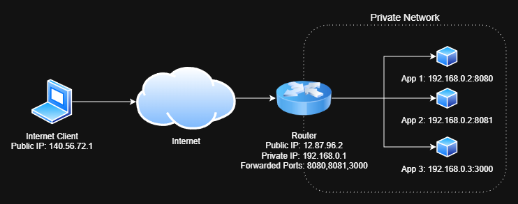
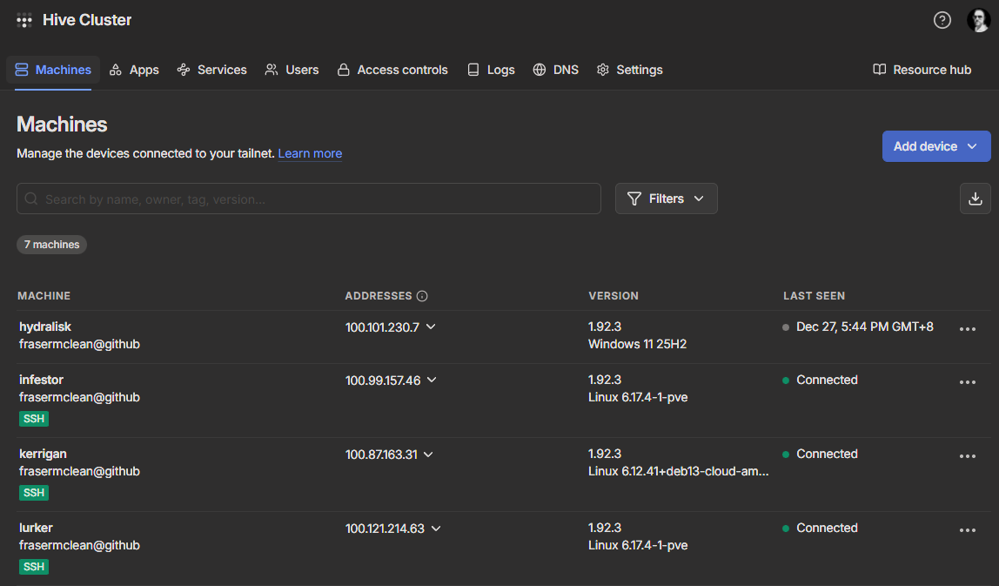

## Introduction

I've been running a homelab in various forms for several years now, hosting applications such as file servers, media servers, home automation platforms, and development environments. One of the challenges I've faced over the years is determining the best way to access these applications, both from within my local network and remotely over the internet. 

While there are many options available, each comes with its own set of trade-offs in terms of security, ease of use, and cost. I wanted to share some of the methods I've explored for remotely accessing self-hosted applications, along with their pros and cons.

## VPN (Virtual Private Network)

Used widely for secure remote access, a VPN allows you to create a secure connection to your homelab network from anywhere in the world. By connecting to the VPN, you can access your self-hosted applications as if you were on the local network. This method provides strong security and privacy, as all traffic is encrypted.

It's a great option if you predominantly access applications locally from trusted devices and only occasionally need remote access.

In the example above, a user on the laptop connects to the homelab VPN server. The VPN server provides with with an IP address of `192.168.0.128`, which allows them to access the applications running on the homelab network (192.168.0.x).

You will need to configure a VPN server on your homelab and install a VPN client on your remote device. A lot of popular consumer routers have built-in VPN server capabilities, or you can use dedicated software like [OpenVPN](https://openvpn.net) or [WireGuard](https://www.wireguard.com).

### VPN Pros
- Strong security and privacy, as all traffic is encrypted.
- Access to the entire home network, allowing you to use local services and resources.
- No need to expose individual applications to the internet.

### VPN Cons
- Requires a [publicly routable IP address](#public-ip-address) and/or [Dynamic DNS](#dynamic-dns) service to connect from outside your home network. If your ISP imposes [CGNAT](#cgnat), VPN access may not be possible.
- VPN clients must be installed and configured on each remote device. The user of each remote device needs to initiate the VPN connection before accessing applications. This can be less convenient than other methods that provide direct access.
- Care should be taken around VPN client credentials as they can provide access to your entire home network if they are compromised.

## Port Forwarding

Port forwarding is the original and most straightforward method of exposing applications. It requires that you have a [publicly accessible IP address](#public-ip-address) and that you configure your router to forward incoming traffic on specific ports to the internal IP address and port of your self-hosted application.

In the example above, the router is configured to forward traffics on ports `8080`, `8081`, and `3000` to the respective applications running on the homelab servers. Therefore, accessing `http://12.87.96.2:8080` from the internet would route the request to the first application.

While this method is simple to set up, it has several drawbacks. It exposes your applications directly to the internet, which can be a security risk if not properly configured. Additionally, managing multiple applications can become cumbersome, as each application requires its own port forwarding rule.

A [reverse proxy](#reverse-proxy) is often used in conjunction with port forwarding to manage multiple applications, provide SSL/TLS encryption and adding authorization layers.

### Port Forwarding Pros
- Initially simple to set up and does not require additional software or services.
- Direct access to applications without the need for intermediary services.

### Port Forwarding Cons
- Opening ports on your router can expose your network to automated attacks from bots scanning for vulnerabilities. Ensure that any exposed services are kept up to date and secured with strong authentication!
- Dynamic IP addresses can complicate access. If your ISP changes your public IP address, you may need to use a [Dynamic DNS](#dynamic-dns) service to keep track of your current IP.
- Reveals your public IP address, which can be a privacy concern.
- SSL/TLS encryption must be managed manually, often requiring the use of [reverse proxies](#reverse-proxy) and certificate management tools like [Let's Encrypt](https://letsencrypt.org).

## TailScale

[TailScale](https://tailscale.com) is a very popular modern VPN solution that greatly simplifies the process of creating a secure network between your devices. It uses the WireGuard protocol to provide encrypted connections between all your devices. Notably, it can get around [CGNAT](#cgnat) and firewall restrictions that typically hinder traditional VPNs. It is particularly well-suited for homelabs due to its ease of setup and use.

TailScale creates a virtual network adapter on each device and assigns each device a fixed unique IP address in the `100.x.x.x` range, allowing them to communicate securely over the internet as if they were on the same local network.

In the example above, each device is connected to the TailScale network, allowing you to access the machine directly using its TailScale IP address (e.g. `100.121.214.63`) or MagicDNS (e.g. `lurker`) name.

### TailScale Funnel
TailScale is currently offering a beta featured called [TailScale Funnel](https://tailscale.com/kb/1223/funnel) lets you route traffic from the 
internet to specific applications on your TailScale-connected devices without needing to set up port forwarding or a traditional VPN connection. This is particularly useful for accessing self-hosted applications remotely. When you enable Funnel for a specific device, TailScale assigns a public URL to that device, allowing you to access the applications running on it directly from the internet.

### TailScale Pros
- Extremely easy to set up and use, with minimal configuration required.
- Works seamlessly across different networks and firewalls, including CGNAT.
- Multiplatform support, including Windows, macOS, Linux, iOS, and Android.
  
### TailScale Cons
- TailScale requires an account with TailScale, which is a third-party service. While the service is free for personal use with some limitations, it does introduce a dependency on an external provider.
- You need to make use of the domain name provided by TailScale, which may not be ideal for all users.
- Traffic sent over a Funnel is subject to non-configurable bandwidth limits. This may not be suitable for high-bandwidth applications like video streaming.

## Cloudflare Tunnel

[Cloudflare Tunnel](https://www.cloudflare.com/products/tunnel/) (formerly known as Argo Tunnel) is a service that allows you to securely expose your self-hosted applications to the internet without opening any ports on your router. It achieves this by creating an outbound connection from your homelab to Cloudflare's network, which then routes incoming traffic to your application.

What's really nifty about Cloudflare Tunnel is that it can run in a Docker container, making it easy to connect to your existing applications via Docker networking. You can define multiple application routes in a single tunnel configuration, allowing you to expose several applications through different subdomains or paths.

As pictured in the example above, you can see how the published route `example.com` maps to the homepage application running at `http://homepage:3000`.

As implied in the name, Cloudflare Tunnel relies on Cloudflare's infrastructure, so you'll need to have a Cloudflare account and configure your domain to use Cloudflare's DNS services. However, the benefits of not having to manage port forwarding or expose your public IP address often outweigh this dependency.

### Cloudflare Access
[Cloudflare Access](https://www.cloudflare.com/products/cloudflare-access/) is an additional security layer that can be used in conjunction with Cloudflare Tunnel. It allows you to enforce authentication and authorization policies for accessing your self-hosted applications. With Cloudflare Access, you can require users to log in using various identity providers (like Google, GitHub, or even your own self-hosted provider) before they can access your applications. This adds an extra layer of security, ensuring that only authorized users can reach your services.

### Cloudflare Tunnel Pros
- No need to open ports on your router, enhancing security.
- Easily manage multiple applications through a single tunnel configuration.
- Built-in SSL/TLS encryption and DDoS protection through Cloudflare's network.
- Access to applications can be controlled via **Cloudflare Access** for added security.
- Can be run in a Docker container, simplifying deployment and integration with existing applications.

### Cloudflare Tunnel Cons
- Dependency on Cloudflare's services, which may not be suitable for all users or use cases. Theorietically, if Cloudflare experiences an outage, your applications may become inaccessible. Additionally, there are privacy considerations when routing traffic through a third-party service.
- Potential latency introduced by routing traffic through Cloudflare's network, although this is often negligible for most applications.
- Free tier term of service has limitations on features and usage such as video streaming, which may limit certain use cases.

## Pangolin

[Pangolin](https://pangolin.net) is an awesome open-source project that allows you to expose your self-hosted applications securely without opening ports on your router. Similar to **Cloudflare Tunnel**, Pangolin creates an outbound connection from your homelab to a public relay server, which then routes incoming traffic to your application. The server includes a built-in reverse proxy to handle multiple application routes along with SSL/TLS encryption. It also includes rich access control mechanisms to restrict access to your applications to authorized users only.

The key difference is that Pangolin can be self-hosted, meaning you can run your own server on a [VPS](#vps) to act as the relay. This gives you ultimate control over your data and eliminates dependency on third-party services. Pangolin also offers a [paid hosted service](https://pangolin.net/pricing) if you prefer not to manage your own server.

### Pangolin Pros
- No need to open ports on your router, enhancing security.
- Can be self-hosted, giving you full control over your data and eliminating third-party dependencies.
- Built-in certificate management for handling multiple applications with SSL/TLS encryption.
- Authentication mechanisms to restrict access to your applications.

### Pangolin Cons
- Self-hosting requires more technical knowledge and effort to set up and maintain.
- Financial costs associated with running a VPS to host the relay server.
- Potential latency introduced by routing traffic through the relay server, depending on its location and performance. Ideally, the VPS should be geographically close to your homelab for optimal performance.

## Personal Recommendations

I've gone over a few of the most popular methods for remotely accessing self-hosted applications, each with its own advantages and disadvantages. As always, the best choice depends on your specific needs and circumstances. I will try and summarise my personal recommendations below:

- Best for ease of use and setup: [TailScale](#tailscale)
- Best for cost-effectiveness and features: [Cloudflare Tunnel](#cloudflare-tunnel)
- Best for control and privacy: [Pangolin](#pangolin) (self-hosted)

## Terminology

Here are some common terms used in the context of this article:

### Public IP Address
A public IP address is an IP address that is accessible from the internet. It is assigned by your Internet Service Provider (ISP) and is used to identify your network on the global internet. Public IP addresses are usually assigned dynamically, meaning they can change over time, although some ISPs offer static public IP addresses for an additional fee.

### Dynamic DNS
Dynamic DNS (DDNS) is a service that automatically updates the DNS records for a domain name whenever the associated IP address changes. This is particularly useful for home networks that often have dynamic public IP addresses assigned by ISPs. By using a DDNS service, you can access your self-hosted applications using a consistent domain name, even if your public IP address changes. Some popular DDNS providers are:
- [No-IP](https://www.noip.com/) 
- [FreeDNS](https://freedns.afraid.org/)

### CGNAT
CGNAT (Carrier-Grade Network Address Translation) is a technique used by ISPs to conserve IPv4 addresses by allowing multiple customers to share a single public IP address. While this helps alleviate the shortage of IPv4 addresses, it can complicate remote access to self-hosted applications, as traditional port forwarding may not work. [Read more about CGNAT](https://en.wikipedia.org/wiki/Carrier-grade_NAT).

### Reverse Proxy
A reverse proxy is a server that sits between client devices and backend servers, forwarding client requests to the appropriate backend server and returning the server's response to the client. Reverse proxies are commonly used to improve security, load balancing, and performance for web applications. Popular reverse proxy software includes:
- [Nginx](https://www.nginx.com/) 
- [Traefik](https://traefik.io/)
- [Caddy](https://caddyserver.com/)

### VPS
A VPS (Virtual Private Server) is a virtualized server that runs on a physical server, providing users with dedicated resources and control over their own server environment. VPS hosting is commonly used for hosting websites, applications, and services that require more control and flexibility than shared hosting. Popular VPS providers include:
- [DigitalOcean](https://www.digitalocean.com/)
- [Linode](https://www.linode.com/)
- [Hetzner](https://www.hetzner.com/)

## Conclusion

I've only covered a few methods here, but as we have seen, there are several methods available for remotely accessing self-hosted applications, each with its own set of advantages and disadvantages. Whether you prioritize ease of use, cost-effectiveness, or control over your data, there is a solution that can meet your needs.

When choosing a method, consider factors such as your technical expertise, security requirements, and the specific applications you want to access. It's also important to stay informed about best practices for securing your self-hosted applications, regardless of the access method you choose.

I hope this article has provided you with a useful overview of the options available for remotely accessing self-hosted applications. Happy hosting!