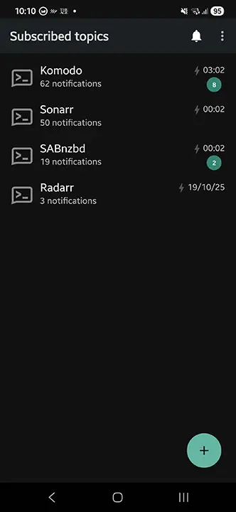
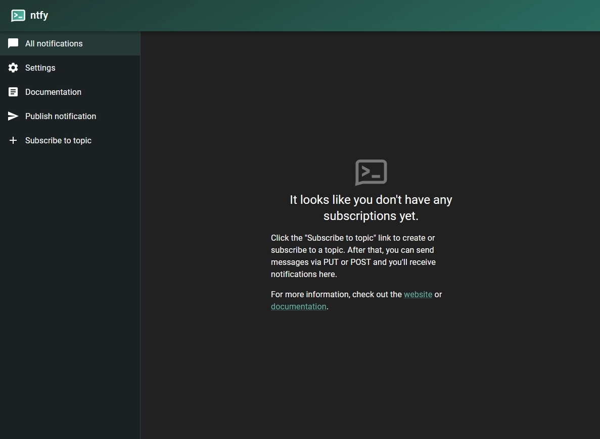
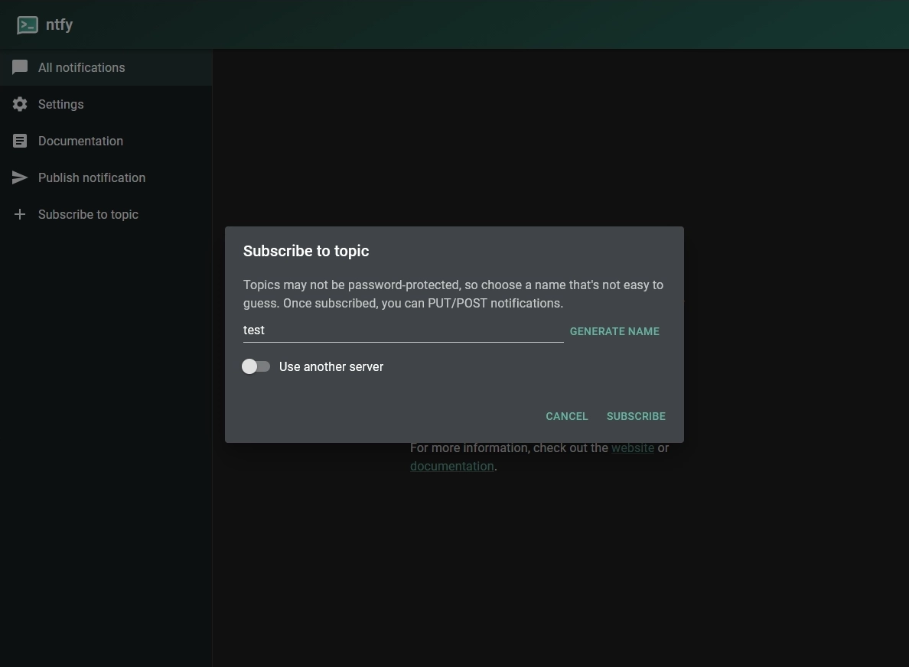
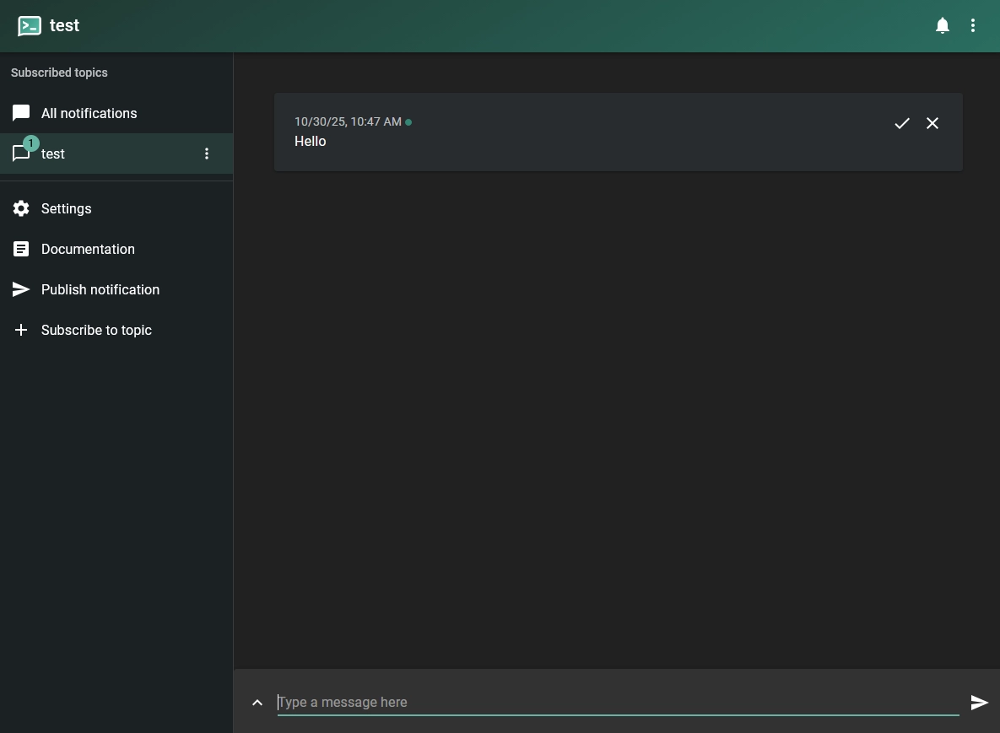
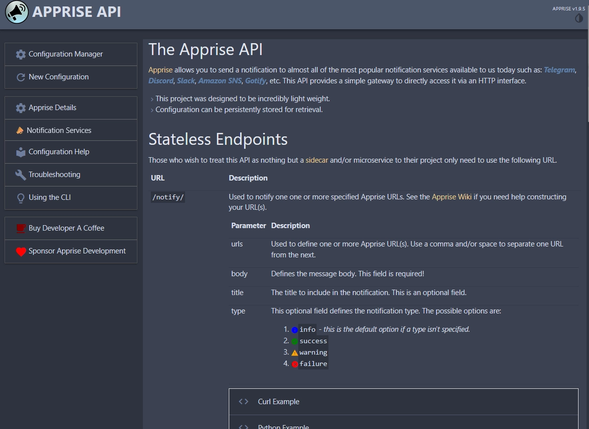
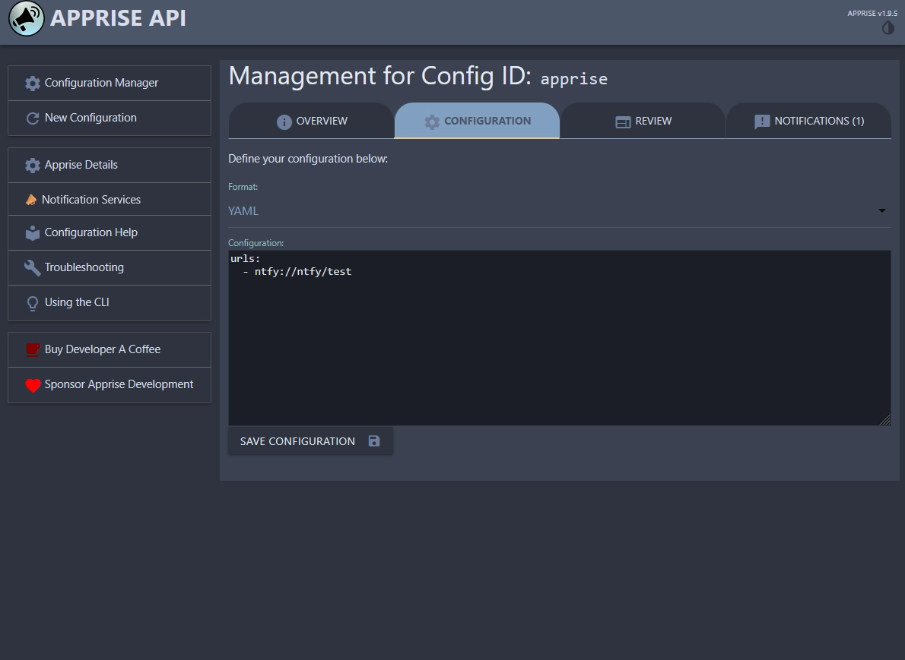
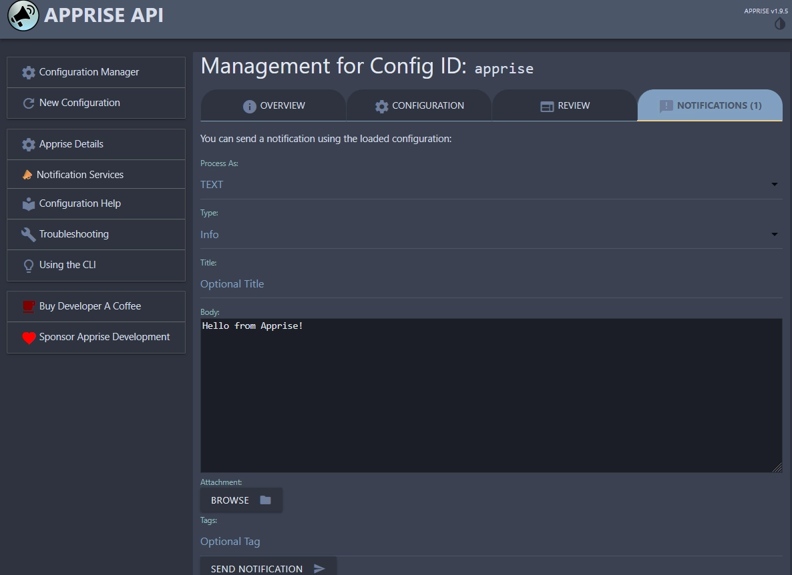
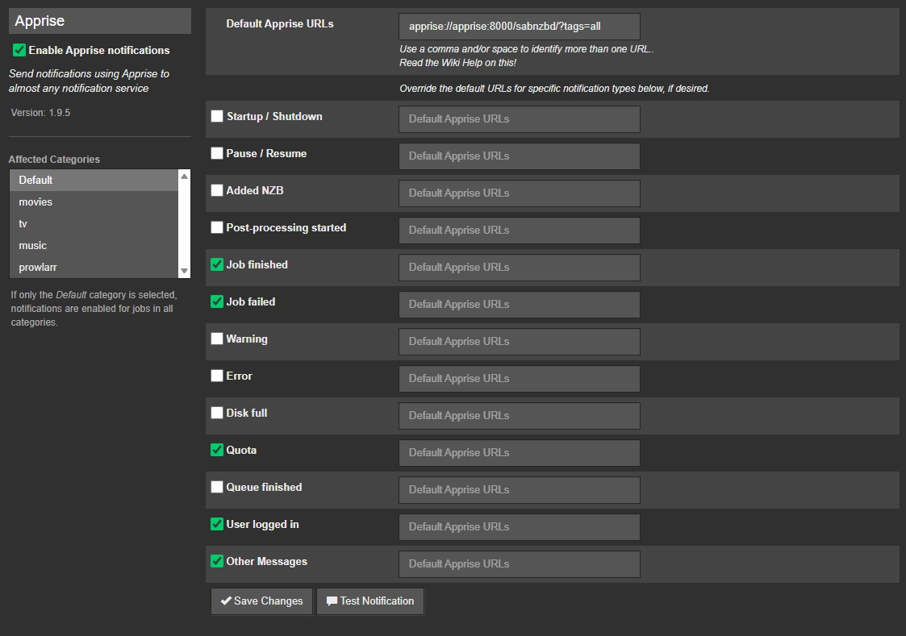

## Introduction

I've been self-hosting various services for a while now, and one thing I've found lacking is a good way to receive notifications from these services. I wanted a solution that was flexible, easy to set up, and could integrate well with various self-hosted applications. Also important to me was a nice mobile notification experience, as I want to be able to receive alerts on my phone wherever I am.

After some research, I believe I have come up with a solid and flexible solution and I want to share it with you. In this guide, I'll walk you through the process of setting up self-hosted notifications.

## Prerequisites

Before we begin, make sure you have the following prerequisites in place:
- Basic knowledge of Docker and Docker Compose.
- A server or computer where you can run Docker and Docker Compose. This could be a dedicated server, a VPS, or even your local machine.
- A web browser to access the ntfy web interface and Apprise dashboard.

## Software Components

There are a couple of key software components involved in this setup:

### ntfy


[ntfy](https://ntfy.sh/) (pronounced notify) is a simple HTTP-based pub-sub notification service. It allows you to send notifications to your phone or desktop via scripts from any computer, and/or using a REST API. The software is lightweight and open source.

#### Topics and subscriptions



The software defines topics to which you can publish messages. Subscribers can then subscribe to these topics to receive notifications. You can also set up authentication for topics to restrict access. The way you organize your topics is up to you, but a common approach is to create a topic for each service or application you want to receive notifications from.

#### Self-hosted vs cloud-hosted

The author of ntfy actually provides a hosted version of the service at [ntfy.sh](https://ntfy.sh/) which you can use for free, but for privacy and control reasons, I decided to self-host my own instance.

### Apprise API


[Apprise](https://github.com/caronc/apprise) is a powerful notification library written in Python that makes sending notifications to multiple destination services easy. It supports a wide range of notification services, including ntfy, email, SMS, and many more. Apprise API is a web service that exposes the functionality of Apprise via a REST API.

#### Why do we need Apprise?

A lot of self-hosted applications already have built-in support for sending notifications directly to ntfy topics. Depending on your use case, this may be sufficient for your needs. However, there are some applications that do not have native support for ntfy, or you may want to centralize your notification management and send notifications to multiple destinations at once.

This is where Apprise comes in. Apprise allows you to define configurtions for multiple notification services in a single place, and then send notifications to all of them with a single command.

### Docker Compose

We will be using Docker Compose to manage the deployment of ntfy and Apprise. Docker Compose allows us to define and run multi-container Docker applications easily in a single file.

## Installation

Here, I will guide you through the steps to set up ntfy and Apprise using Docker Compose. This will be a basic setup, just to get you started. You can customize and expand upon this setup as needed.

1. Define services in a Docker Compose file.
2. Populate environment variables for configuration.
3. Start the services using Docker Compose.

### Docker Compose file

Here is a sample Docker Compose file which defines the ntfy and Apprise services and a persistent volumes for data storage. You may need to adjust the configuration to fit your specific needs. Save this file as `compose.yml` in an empty directory of your choice.

The file makes use of environment variables with default values provided (such as `PUID`, `PGID`, and `TZ`). You will probably want to create a `.env` file to override these defaults.

```yaml
name: notifications

services:
  ntfy:
    image: 'binwiederhier/ntfy:latest'
    restart: 'unless-stopped'
    command: ['serve']
    user: ${PUID:-1000}:${PGID:-100} # optionally run as non-root user (adjust PUID:PGID as needed)
    environment:
      TZ: ${TZ:-Etc/UTC} # adjust to your timezone - https://en.wikipedia.org/wiki/List_of_tz_database_time_zones
    ports:
      - 8080:80 # adjust host port as needed
    volumes:
      - 'ntfy-data:/var/lib/ntfy'
    healthcheck: # optional, remember to adjust the host:port to your environment
      test:
        - 'CMD-SHELL'
        - "wget -q --tries=1 http://localhost:80/v1/health -O - | grep -Eo '\"healthy\"\\s*:\\s*true' || exit 1"
      interval: 60s
      timeout: 10s
      retries: 3
      start_period: 40s
    init: true # needed, if healthcheck is used. prevents zombie processes

  apprise:
    image: caronc/apprise:latest
    restart: unless-stopped
    environment:
      - PUID=${PUID:-1000}
      - PGID=${PGID:-100}
      - APPRISE_STATEFUL_MODE=simple
      - APPRISE_WORKER_COUNT=1
    ports:
      - 8000:8000 # adjust host port as needed
    volumes:
      - apprise-config:/config
      - apprise-plugin:/plugin
      - apprise-attach:/attach

volumes:
  ntfy-data:
  apprise-config:
  apprise-plugin:
  apprise-attach:
```

### Environment variables

By default, Docker Compose looks for a file named `.env` in the same directory as the `compose.yml` file to define environment variables. Here is a sample `.env` file that you can use to set the necessary environment variables for the services:

```dotenv
TZ="Asia/Singapore" # adjust to local timezone (affects log timestamps)
PUID=1000 # user ID to run services as (use 'id -u' to find your UID)
PGID=100 # group ID to run services as (use 'id -g' to find your GID)
```

Alternatively, you can use the raw values directly in the `compose.yml` file, but using a `.env` file is generally more flexible and secure.

### Starting the services

With the Docker Compose file and environment variables in place, you can start the services by running the following command in the directory where your `compose.yml` file is located:

```bash
docker compose up -d
```

If all goes well, you should see both services starting up without any errors. If you used the ports specified in the sample `compose.yml`, you can access the [ntfy web interface](http://localhost:8080) and the [Apprise dashboard](http://localhost:8000).

## Configuration

Now that the services are up and running, it's time to configure them.

### Ntfy Configuration

#### Accessing the web interface

The default web interface for ntfy is quite simple and straightforward. You can subscribe to topics and send a test notification directly from the web interface.



#### Subscribing to a topic

Let's create a topic for testing. In the web interface, click **Subscribe to topic** and enter the name `test`. You should now be subscribed to the `test` topic.



#### Sending a test notification

Whilst viewing the `test` topic, type your message in the input box. Enter a message like "Hello from ntfy!" and click **Send**. You should see the notification appear in the topic view.



### Apprise Configuration

Now that we have our destination topic set up in ntfy, let's configure Apprise to send notifications to this topic.



Apprise supports multiple configurations each of which can be set up to deliver notifications to different services. Inside each configuration, Apprise makes use of URLs to define the destination services.

#### Defining an Apprise configuration

Configuration can be added or managed via the interface. The default configuration ID is `apprise` and if you click on **Configuration Manager**, it will be loaded. You can load another configuration by typing it into the browser address bar e.g.: `http://localhost:8000/cfg/test`. Saving any changes will result in a new configuration being created and persisted to disk.



So, in order to deliver notifications to our ntfy topic, we need to add a new URL to the configuration. Save the following YAML snippet into the configuration:

```yaml
urls:
  - ntfy://ntfy/test
```

In the above example `ntfy://` is the scheme that tells Apprise to use the ntfy service, `ntfy` is the hostname of our ntfy server (adjust if necessary), and `test` is the topic we created earlier.

#### Sending a test notification

Click on the **Notification** tab and enter a test message like "Hello from Apprise!" and click **Send Notification**. If everything is set up correctly, you should see the notification appear in the ntfy web interface under the `test` topic.



### SABnzbd Integration Example

Now that everything is finally set up, let's integrate a self-hosted application to send notifications via Apprise. As an example, we will use [SABnzbd](https://sabnzbd.org/), a popular binary newsreader. The application has built-in support for sending notifications via Apprise.



Under the SABnzbd settings, navigate to the **Notifications** tab. Enable Apprise notifications and enter the URL of your Apprise server along with the configuration ID if necessary. The URL format should be something like this: `apprise://apprise:8000/test/?tags=all`. The `test` at the end corresponds to the configuration ID we created earlier in Apprise. You may select which events you want to receive notifications for.

Save changes and press **Test Notification** to verify that everything is working correctly. You should see a notification appear in your ntfy topic 😊.

> This example makes the assumption that the SABnzbd server can reach the Apprise server using the hostname `apprise`. You may need to adjust your Docker networks to allow this communication or use the appropriate IP address or hostname.

## Conclusion

There you have it! You now have a self-hosted notification system using ntfy and Apprise. This setup provides a flexible and powerful way to receive notifications from your self-hosted applications. Of course, this is just a basic setup to get you started. We haven't touched on security aspects such as enabling authentication for ntfy topics or securing the Apprise API. I encourage you to explore the documentation for both ntfy and Apprise to learn more about their capabilities and how to customize them further to suit your needs. I hope you found this guide helpful, and happy self-hosting!
