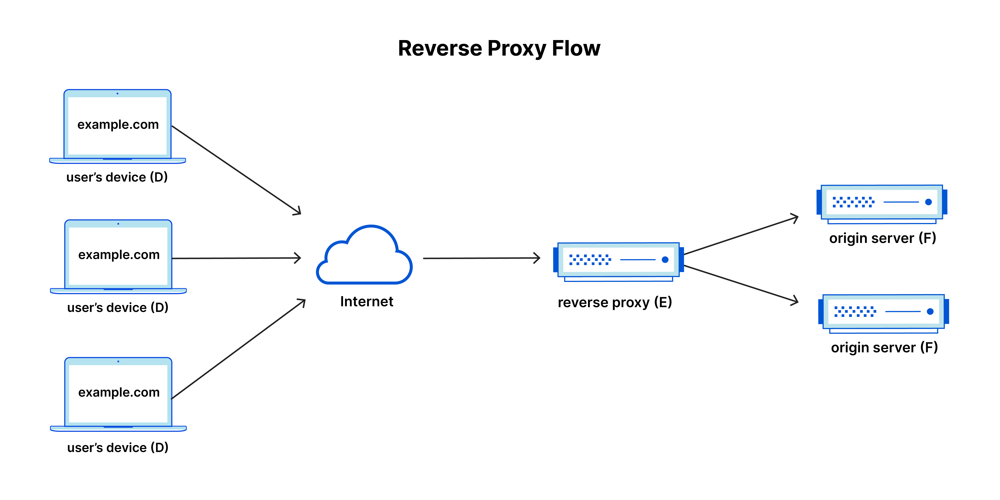

## Introduction

In this guide, we will explore how to set up [Traefik as a reverse proxy](https://traefik.io/traefik) with automatic certificate management using Docker Compose. Traefik is a modern, dynamic reverse proxy that can automatically discover services and manage SSL certificates using [Let's Encrypt](https://letsencrypt.org/). This setup is ideal for self-hosted applications, allowing you to securely expose your services to the internet without the hassle of manual certificate management.

### What is a Reverse Proxy?

A reverse proxy is a server that sits between client devices and backend servers, forwarding client requests to the appropriate backend server and returning the server's response to the client. It acts as an intermediary for requests from clients seeking resources from servers, providing various benefits such as load balancing, security, and SSL termination.

It's called a "reverse" proxy because it performs the opposite function of a traditional forward proxy, which acts on behalf of clients to access resources on the internet. In contrast, a reverse proxy acts on behalf of servers to handle incoming requests from clients.

## Prerequisites

In order to follow this guide, you will need the following:

- A server or local machine with Docker and Docker Compose installed. You're probably going to want to use an up-to-date Linux distribution for this. My personal recommendation is [Debian](https://www.debian.org/), but you can use any distribution that supports Docker.
- Exposed ports 80 and 443 on your server for HTTP and HTTPS traffic. If you're not too sure what this means, check out my other post's [section on port forwarding](/posts/remotely-accessing-self-hosted-applications#port-forwarding) for more details.
- A domain name that you own and can point to your server's public IP address. I will use `example.com` in this guide, but you should replace it with your actual domain name.
