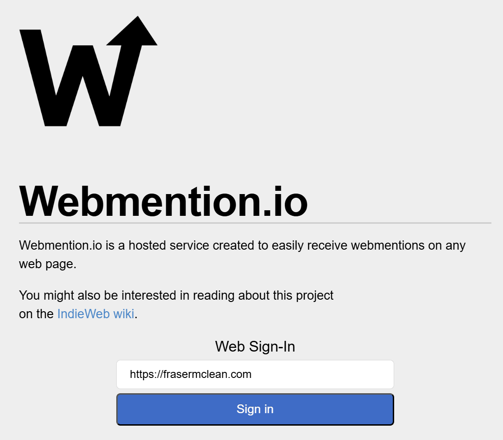
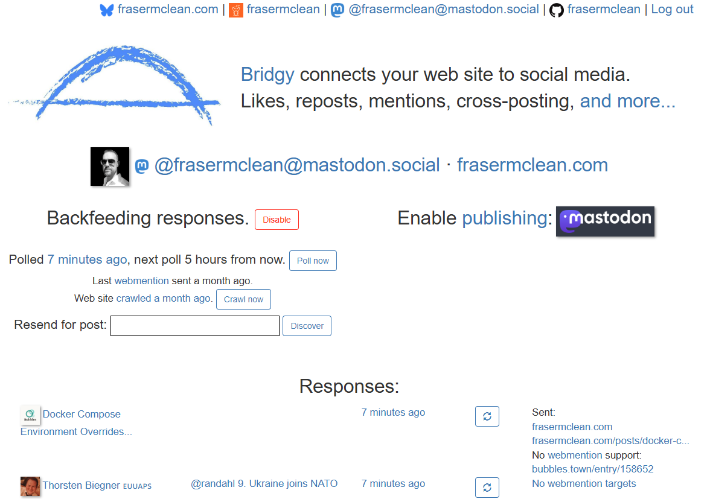
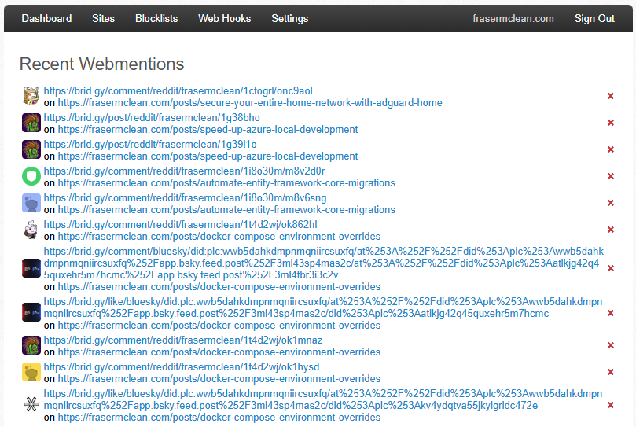

## Introduction

When I am writing a blog post, I often share it to communities on Reddit, Mastodon and Bluesky. In the IndieWeb community, this is called [POSSE](https://indieweb.org/POSSE). I love engaging with people in those communities, and I often get comments and likes on my posts. However, those interactions are happening on other platforms, and they aren't visible on my personal site. I wanted to find a way to bring those interactions back to my site so that visitors can see the conversations happening around my content.

I like social features, they make a site feel more alive and interactive. I was looking for a way to add some social features to my personal site, and I came across [Webmentions](https://indieweb.org/Webmention). It took me a little while to get my head around how Webmentions work, but once I understood the basics, it was pretty straightforward to implement. In this post, I'll walk you through how I added Webmention support to my [Astro](https://astro.build/) site to display comments and likes from other websites.

## What are Webmentions?

Webmention is an [open web standard](https://www.w3.org/TR/webmention/) which is designed for conversations and interactions across the web. It facilitates cross-site communication by allowing websites to send notifications when they are mentioned or linked to by other sites. It is one of the key building blocks of the [IndieWeb](https://indieweb.org/) movement, which emphasizes user ownership and control over their online presence.

## Implementation

Here, I will go through the steps I took to implement Webmention support on my Astro site. 

### Add Webmention Endpoint

The first thing we need to do is add the ability for our site to receive Webmentions. We could read through the [protocol specifications](https://webmention.net/draft/#receiving-webmentions) and implement the endpoint ourselves, but I found a great tool called [webmention.io](https://webmention.io/) that simplifies the process. It provides a hosted Webmention endpoint that we can use to receive Webmentions without having to set up our own server logic.



Enter your site URL and sign in. Your site will need to have [IndieLogin.com](https://indielogin.com/) support which is relatively easy to set up. Once you have signed in, you will be given a Webmention link tag that you can add to your site's `<head>` section. This tag should be on every page and tells other websites where to send Webmentions when they mention your site.

The link tag for my site looks like this:

```html
<link rel="webmention" href="https://webmention.io/frasermclean.com/webmention" />
```

### Testing the Endpoint

Now that we have our Webmention endpoint set up, we can test it out to make sure that we can actually receive Webmentions. I came across this great validation tool called [Webmention Rocks](https://webmention.rocks/) that allows you to test your Webmention endpoint by sending a test Webmention to it.

### Connect Social Platforms

It would be amazing if we could automatically receive Webmentions from the social platforms where we share our content. Well, it just so happens there are tools that do exactly that! [Bridgy](https://brid.gy/) is a awesome service that can connect your site to various social platforms and send Webmentions when your content is mentioned or liked on those platforms.



I set up Bridgy to connect my site to **Reddit**, **Mastodon** and **Bluesky**, so that I can receive Webmentions for interactions happening on those platforms.

Back on the webmention.io dashboard, we can view the recent Webmentions that we have received. 



### Querying the Webmention.io API

Webmention.io provides an [API](https://github.com/aaronpk/webmention.io#api) that allows us to query the Webmentions we have received through the service. This is useful as we can use this API to fetch the comments and likes and display them on our site. 

We can use the [cURL](https://curl.se/) command line utility to test out the API and see what kind of data we get back:

```bash
curl "https://webmention.io/api/mentions.jf2?target=https://example.com/posts/123"
```

You would need to replace the `target` parameter with the URL of the page on your site that you want to fetch Webmentions for. The API will return a JSON response containing the Webmentions that have been received for that URL. Here is an example response showing just a single Webmention:

```json
{
  "type": "feed",
  "name": "Webmentions",
  "children": [
    {
      "type": "entry",
      "author": {
        "type": "card",
        "name": "example-user",
        "photo": "https://avatars.webmention.io/www.redditstatic.com/abcdef.png",
        "url": "https://reddit.com/user/example-user/"
      },
      "url": "https://reddit.com/r/dotnet/comments/xxx123/example-post/yyy456/",
      "published": "2026-04-24T05:46:16+00:00",
      "wm-received": "2026-05-07T09:36:34Z",
      "wm-id": 1234567,
      "wm-source": "https://brid.gy/comment/reddit/example-user/xxx123/yyy456",
      "wm-target": "https://example.com/posts/123",
      "wm-protocol": "webmention",
      "content": {
        "html": "<p>Cool idea, thanks for sharing!</p>",
        "text": "Cool idea, thanks for sharing!"
      },
      "in-reply-to": "https://example.com/posts/123",
      "wm-property": "in-reply-to",
      "wm-private": false
    },
  ]
}
```

### Rendering Webmentions on the Page

We can parse then this JSON response in our site code and use it to display the Webmentions on our pages. This part is up to you and how you want to display the Webmentions. The API is publicly accessible, so you could fetch the Webmentions client-side and render them using JavaScript.

In my case, I am using Astro's server-side rendering capabilities to fetch the Webmentions from the API and render them on the page when it is requested. You should hopefully be able to see the reactions at the bottom of this post! If you're interested in how I implemented this, you can check out the [source code on GitHub](https://github.com/frasermclean/personal-site/blob/e60c07b46a3e24653bb8e97bca307e5ba3b9ae75/src/components/post-view/PostReactions.astro).


## Conclusion

There you have it! That's how I added Webmention support to my Astro site to display comments and likes from other websites. It was a fun project to work on, and it has been great to see the interactions happening around my content in one place on my site.

I am also adding additional features such as local likes and comments that are stored in a database, so that visitors can interact with my content directly on my site as well. I will likely write another post about how I implemented those features once they are ready. I'm still learning about Webmentions and the IndieWeb in general, so if you have any tips or suggestions, feel free to reach out to me!
